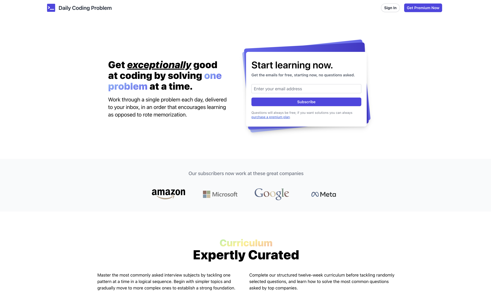

# Daily Coding Problem (DCP)




An application whose goal is to provide a platform for users to solve daily coding problems and improve their problem-solving skills. Users sign up by providing their email address and DCP will send them a daily coding problem to solve. If the user would like solutions to their past problems, they can upgrade to a _premium_ account.

## Table of Contents

- [Project Overview](#project-overview)
- [Features](#features)
- [Project Structure](#project-structure)
- [Installation](#installation)
- [Usage](#usage)
- [License](#license)

## Project Overview

This project is a full-stack application built with Next.js and Tailwind CSS.

## Features

- User authentication
  - Premium account upgrade-flow
  - User profile
- Daily coding problems
  - Problem Solutions (premium feature)

## Project Structure

```
.
├── components/
│   ├── ConfettiButton.tsx
│   ├── Layout.tsx
├── pages/
│   ├── api/
│   │   ├── subscribe.ts
│   │   ├── verify-email.ts
│   ├── _app.tsx
│   ├── _document.tsx
│   ├── index.tsx
├── public/
├── sections/
│   ├── curriculum/
│   ├── faq/
│   ├── footer/
│   ├── header/
│   ├── hero/
│   ├── plans/
│   ├── premium/
│   ├── sample/
├── styles/
│   ├── global.css
├── .env.example
├── .gitignore
├── package.json
├── tailwind.config.js
├── tsconfig.json
├── vercel.json
├── Dockerfile
├── docker-compose.yaml
├── .dockerignore
├── postcss.config.js
├── next-env.d.ts
└── pnpm-lock.yaml
```

## Installation

Clone the repository.

```bash
git clone https://github.com/daily-coding-problem/frontend.git
cd frontend
```

Install the dependencies.

```bash
pnpm install
```

Create a `.env` file in the root directory and add the environment variables found in [`.env.example`](/.env.example).

## Usage

Start the development server.

```bash
pnpm dev
```

Open [http://localhost:3000](http://localhost:3000) with your browser to see the application.

### Docker

Build the Docker image.

```bash
docker compose build
```

Run the Docker container.

```bash
docker compose up
```

## License

This project is licensed under the MIT License - see the [LICENSE](LICENSE) file for details.
